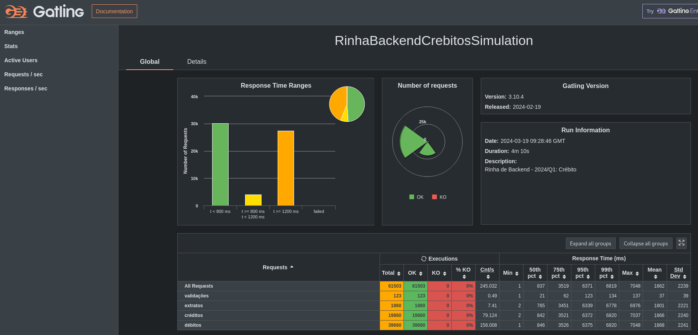
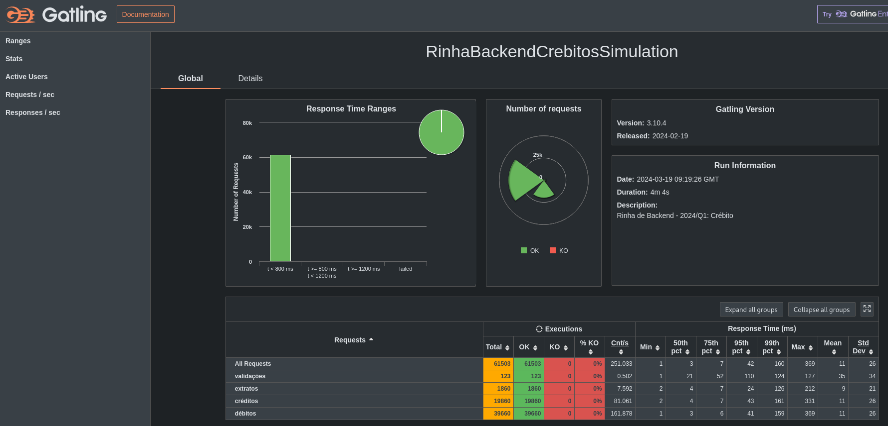

# Codigo para rinha de backend 2024 Q1
## Requisitos
requer:
- python 3.11
- poetry 1.7.x


### Antes de iniciar o container de testes ou o ambiente
Antes de iniciar o ambiente ou o container de teste, é necessário atualizar o arquivo requirements.txt, para isso, execute o comando:
```bash
poetry export -f requirements.txt --without-hashes --without dev > requirements.txt
```

### inicializar contianer de teste
```bash
make test/setup/infra/start
```

### Iniciar o ambiente
```bash
docker compose up
```

# Resultados
Com a sincronização de transações habilitada
 

Com a sincronização desabilitada

